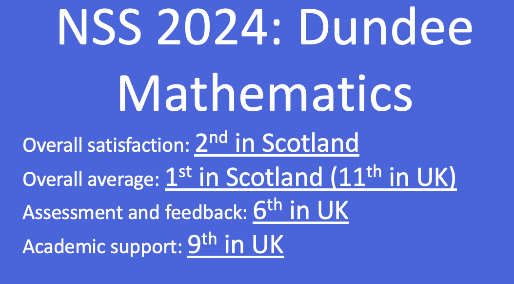
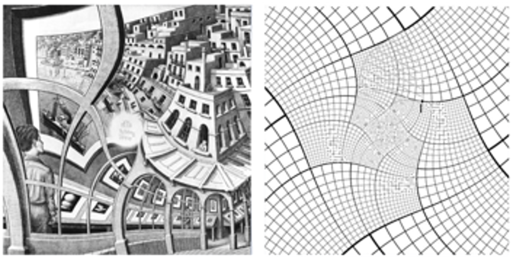

## Why Mathematics?

* route into many numerate professions
* diverse career opportunities
* learn a *language* that can be applied in many contexts
* well paid jobs
* learn skills for the digital age


. . .

* Because you enjoy it!


## What happens on a Mathematics degree?
:::: {.columns}

::: {.column width="60%"}

* Build from Higher/Advanced Higher Mathematics
* Learn how to apply mathematics to real world problems
* Develop programming skills needed to solve mathematical problems
* Develop communication skills

:::

::: {.column width="40%"}

:::

::::

. . .

 Learn to become a *logical numerate problem solver*


## Logical numerate problem solvers are valued

:::: {.columns}

::: {.column width="50%"}


:::

::: {.column width="50%"}

:::
::::

www.ima.org


## What have recent Dundee graduates gone on to do?

:::: {.columns}

::: {.column width="50%"}
* Actuaries
* Accountants
* Data analysts
* Engineers
* Trade analysts
:::

::: {.column width="50%"}

* App. developers
* Teachers
* Academia
* Programmers
:::
::::


## How is Mathematics taught at Uni?

* develop core syllabus (e.g. algebra and calculus) 
* learn about new mathematical topics (e.g. statistics, dynamical systems, differential geometry, operational research ...)

* lectures (50 minute, twice a week)
* weekly tutorials (usually associated with worksheets)
* computer labs (develop programming skills)


## Flex your mathematical muscles with a final year project 

- develop independent problem solving skills
- develop programming and presentation skills


:::: {.columns}

::: {.column width="50%"}
* The $25,000,000,000 eigenvector
* The mathematics of monopoly
* How sat. navs work?
:::
::: {.column width="50%"}



:::
::::


# Today's activity

## Mathematical modelling

- Formulate problem
- Define variables
- Governing equations
- Calculate solutions
- Insight

## Musical notes {.smaller} 

- Why does the pitch of a string change as we adjust the tuning heads?
- Why does the pitch change when string length changes (e.g. by clamping strings on frets)?
- Why do some notes sound *nice* together?
- Why does an expensive musical instrument sound *nicer* than a cheaper one? 


## A mathematical model of a stretched string


### Formulation 

- a stretched string of length $L$ (e.g. a guitar string).
- tension, $T$, and line density, $\mu$. 

- Let $u(x,t)$ represent the displacement of the string at a given position, $x$, at time, $t$.

- Plucking initiates the vibration which generates the sound.


## The wave equation

- The equation is
$$
\frac{\partial ^2 u}{\partial t^2}=c^2 \frac{\partial ^2 u}{\partial x^2},
$$

-  The wavespeed
$$
c=\sqrt{\frac{T}{\mu}},
$$


- Assume *static clamped string* boundary and initial  conditions


## Standing wave solutions 

- Standing waves
 $$
 u(x,t)=\sin(\frac{n\pi x}{L})\cos(\frac{n\pi c t}{L}), \quad n=1,2,...
 $$
 

- The frequency is
$$
f=\frac{n}{2L}\sqrt{\frac{T}{\mu}}, \quad n =1,2,...
$$

## Computing a solution

:::{#fig-weqn}

```{shinylive-python}
#| standalone: true
#| components: [viewer]
#| viewerHeight: 650

from shiny import App, ui, render, reactive
from shinywidgets import output_widget, render_widget
import numpy as np
import plotly.graph_objects as go
from scipy.signal import spectrogram
import matplotlib.pyplot as plt


app_ui = ui.page_fluid(

    ui.h2("Wave Equation on a Vibrating String"),
    ui.p(
        "Interactive solution of the 1D wave equation."
    ),
    ui.layout_sidebar(

        ui.sidebar(

            ui.input_slider(
                "L",
                "String Length L (m)",
                min=0.5,
                max=2.0,
                value=1.0,
                step=0.05,
            ),

            ui.input_slider(
                "T",
                "Tension T (N)",
                min=1,
                max=500,
                value=100,
                step=1,
            ),

            ui.input_slider(
                "mu",
                "Linear Density μ (kg/m)",
                min=0.001,
                max=0.05,
                value=0.01,
                step=0.001,
            ),

            ui.input_slider(
                "n",
                "Mode Number n",
                min=1,
                max=6,
                value=1,
                step=1,
            ),

            ui.input_slider(
                "A",
                "Amplitude A",
                min=0.1,
                max=2.0,
                value=1.0,
                step=0.1,
            ),

            ui.input_slider(
                "time",
                "Time t (s)",
                min=0.0,
                max=2.0,
                value=0.0,
                step=0.01,
                animate=True,
            ),
        ),

        ui.div(

            ui.h4("Computed Quantities"),

            ui.output_text_verbatim("summary"),

            ui.hr(),

            ui.h4("Wave Motion"),

            output_widget("wave_plot"),        
        ),
    ),
)

def server(input, output, session):

    @reactive.calc
    def wave_speed():

        return np.sqrt(
            input.T() / input.mu()
        )


    @reactive.calc
    def frequency():

        return (
            input.n()
            * wave_speed()
            / (2 * input.L())
        )

    @output
    @render.text
    def summary():

        return (
            f"Wave speed c = {wave_speed():.2f} m/s\n"
            f"Frequency f = {frequency():.2f} Hz\n\n"
            f"Wave equation:\n"
            f"u_tt = c² u_xx"
        )

    # --------------------------------------------------------
    # Time-dependent wave solution
    # --------------------------------------------------------

    @output
    @render_widget
    def wave_plot():

        L = input.L()

        n = input.n()

        A = input.A()

        c = wave_speed()

        t = input.time()

        x = np.linspace(0, L, 400)

        # Exact standing-wave solution
        y = (
            A
            * np.sin(n * np.pi * x / L)
            * np.cos(n * np.pi * c * t / L)
        )

        fig = go.Figure()

        fig.add_scatter(
            x=x,
            y=y,
            mode="lines",
        )

        fig.update_layout(
            height=450,
            title=(
                f"Standing Wave "
                f"(t = {t:.2f} s)"
            ),
            xaxis=dict(range=[0, 2]),
            yaxis=dict(range=[-2, 2]),
            xaxis_title="Position x (m)",
            yaxis_title="Displacement",
        )

        fig.update_yaxes(
            range=[-2.1, 2.2]
        )

        return fig

app = App(app_ui, server)

```
:::


## Representing general sounds 

- Sound waves are pressure/density disturbances that propagate through a medium (e.g. air). 
- A microphone detects pressure waves recorded at a given point in space.

- We can represent a signal as a sum of terms of different frequencies. 
- This information can also be presented in a spectrogram. We expect noise to have a messy spectrogram as there are components with lots of frequencies.

## Spectrogram of wave equation solution

:::{#fig-weqn}

```{shinylive-python}
#| standalone: true
#| components: [viewer]
#| viewerHeight: 650

from shiny import App, ui, render, reactive
from shinywidgets import output_widget, render_widget
import numpy as np
import plotly.graph_objects as go
from scipy.signal import spectrogram
import matplotlib.pyplot as plt

# ============================================================
# UI
# ============================================================

app_ui = ui.page_fluid(

    ui.h2("Wave Equation on a Vibrating String"),

    ui.p(
        "Interactive solution of the 1D wave equation."
    ),

    ui.layout_sidebar(

        ui.sidebar(

            ui.input_slider(
                "L",
                "String Length L (m)",
                min=0.5,
                max=5.0,
                value=1.0,
                step=0.1,
            ),

            ui.input_slider(
                "T",
                "Tension T (N)",
                min=100,
                max=5000,
                value=4000,
                step=1,
            ),

            ui.input_slider(
                "mu",
                "Linear Density μ (kg/m)",
                min=0.001,
                max=0.05,
                value=0.01,
                step=0.001,
            ),

            ui.input_slider(
                "n",
                "Mode Number n",
                min=1,
                max=6,
                value=1,
                step=1,
            ),

            ui.input_slider(
                "A",
                "Amplitude A",
                min=0.1,
                max=2.0,
                value=1.0,
                step=0.1,
            ),

            ui.input_slider(
                "time",
                "Time t (s)",
                min=0.0,
                max=2.0,
                value=0.0,
                step=0.01,
                animate=True,
            ),
        ),

        ui.div(

            

            ui.h4("Wave Motion"),

            output_widget("wave_plot"),

            ui.hr(),
            ui.output_plot("freq_plot"),
            ui.h4("Computed Quantities"),

            ui.output_text_verbatim("summary"),

            ui.hr(),
        ),
    ),
)

def server(input, output, session):

    @reactive.calc
    def wave_speed():

        return np.sqrt(
            input.T() / input.mu()
        )

    @reactive.calc
    def frequency():

        return (
            input.n()
            * wave_speed()
            / (2 * input.L())
        )

    @output
    @render.text
    def summary():

        return (
            f"Wave speed c = {wave_speed():.2f} m/s\n"
            f"Frequency f = {frequency():.2f} Hz\n\n"
            f"Wave equation:\n"
            f"u_tt = c² u_xx"
        )

    @output
    @render_widget
    def wave_plot():

        L = input.L()

        n = input.n()

        A = input.A()

        c = wave_speed()

        t = input.time()

        x = np.linspace(0, L, 400)

        # Exact standing-wave solution
        y = (
            A
            * np.sin(n * np.pi * x / L)
            * np.cos(n * np.pi * c * t / L)
        )

        fig = go.Figure()

        fig.add_scatter(
            x=x,
            y=y,
            mode="lines",
        )

        fig.update_layout(
            height=150,
            title=(
                f"Standing Wave "
                f"(t = {t:.2f} s)"
            ),
            xaxis=dict(range=[0, 2]),
            yaxis=dict(range=[-2, 2]),
            xaxis_title="Position x (m)",
            yaxis_title="Displacement",
        )

        fig.update_yaxes(
            range=[-2.1, 2.2]
        )

        return fig

    @render.plot
    def freq_plot():

        
        window = 1024

        overlap_fraction = 0.5

        noverlap = int(
            window * overlap_fraction
        )
        L = input.L()

        n = input.n()

        A = input.A()

        c = wave_speed()


        SAMPLE_RATE=1000.0
        T=10.0

        t = np.linspace(0,T,int(SAMPLE_RATE*T))

        x_samp = L*0.333

        # Exact standing-wave solution
        y = (
            A
            * np.sin(n * np.pi * x_samp / L)
            * np.cos(n * np.pi * c * t / L)
        )


        freqs, times, Sxx = spectrogram(
            y,
            fs=SAMPLE_RATE,
            nperseg=window,
            noverlap=noverlap,
        )

        # Convert to dB
        Sxx_db = 10 * np.log10(
            Sxx + 1e-10
        )

        fig, ax = plt.subplots(
            figsize=(10, 5)
        )

        mesh = ax.pcolormesh(
            times,
            freqs,
            Sxx_db,
            shading="gouraud",
        )

        ax.set_yscale("log")
        ax.set_xlabel("Time (s)")
        ax.set_ylabel("Frequency (Hz)")
        ax.set_title(
            "Spectrogram"
        )
        fig.colorbar(
                mesh,
                ax=ax,
                label="Power (dB)"
            )
        plt.show()

app = App(app_ui, server)

```
:::

## Now we look at the spectograms of different sounds

- Play a single monotone note
- White noise
- A scale 
- A major chord

## Sound recording app
::: {#fig-integapp}

```{shinylive-python}
#| standalone: true
#| components: [viewer]
#| viewerHeight: 650
#| 
from shiny import App, ui, reactive, render
import numpy as np
import matplotlib.pyplot as plt
from scipy.signal import spectrogram

SAMPLE_RATE = 44100
RECORD_SECONDS = 10
MAX_SAMPLES = SAMPLE_RATE * RECORD_SECONDS
app_ui = ui.page_fluid(

    ui.tags.head(

        ui.tags.script(
            f"""
            let audioContext;
            let microphone;
            let processor;

            let recording = false;

            async function startRecording() {{

                if (recording) {{
                    return;
                }}

                recording = true;

                console.log("Recording started");

                const stream =
                    await navigator.mediaDevices.getUserMedia({{
                        audio: true
                    }});

                audioContext =
                    new AudioContext();

                microphone =
                    audioContext.createMediaStreamSource(stream);

                processor =
                    audioContext.createScriptProcessor(
                        2048,
                        1,
                        1
                    );

                microphone.connect(processor);

                processor.connect(
                    audioContext.destination
                );

                const startTime = Date.now();

                processor.onaudioprocess = function(e) {{

                    if (!recording) {{
                        return;
                    }}

                    const input =
                        e.inputBuffer.getChannelData(0);

                    const arr = Array.from(input);

                    Shiny.setInputValue(
                        "audio_chunk",
                        arr,
                        {{priority: "event"}}
                    );

                    const elapsed =
                        (Date.now() - startTime) / 1000;

                    Shiny.setInputValue(
                        "recording_time",
                        elapsed,
                        {{priority: "event"}}
                    );

                    if (elapsed >= {RECORD_SECONDS}) {{

                        recording = false;

                        processor.disconnect();
                        microphone.disconnect();

                        stream.getTracks().forEach(
                            track => track.stop()
                        );

                        console.log("Recording finished");

                        Shiny.setInputValue(
                            "recording_done",
                            Math.random(),
                            {{priority: "event"}}
                        );
                    }}
                }};
            }}

            document.addEventListener(
                "DOMContentLoaded",
                function() {{

                    const btn =
                        document.getElementById("start");

                    btn.onclick = async function() {{

                        try {{

                            await startRecording();

                        }} catch(err) {{

                            console.error(err);

                            alert(
                                "Microphone error: " + err
                            );
                        }}
                    }};
                }}
            );
            """
        ),
    ),

    ui.h2("Interactive Audio Spectrogram"),

    ui.layout_sidebar(

        ui.sidebar(

            ui.input_action_button(
                "start",
                "Record / Re-record"
            ),

            ui.hr(),

            ui.input_slider(
                "freq_lim",
                "Frequency limits (Hz)",
                min=50,
                max=22050,
                value=[50,2000],
                step=20,
            ),

            ui.input_select(
                "scale",
                "Frequency Scale",
                choices={
                    "linear": "Linear",
                    "log": "Logarithmic",
                },
                selected="linear",
            ),

            ui.input_slider(
                "window",
                "FFT Window Size",
                min=256,
                max=4096,
                value=1024,
                step=256,
            ),

            ui.input_slider(
                "overlap",
                "Overlap (%)",
                min=0,
                max=95,
                value=50,
                step=5,
            ),

            ui.input_checkbox(
                "show_colorbar",
                "Show Colorbar",
                value=True,
            ),
        ),

        ui.card(
            ui.card_header("Status"),
            ui.output_text_verbatim("status"),
        ),

        ui.card(
            ui.card_header("Spectrogram"),
            ui.output_plot("spectrogram_plot"),
        ),
    ),
)

# =====================================================
# SERVER
# =====================================================

def server(input, output, session):

    # Audio storage
    recorded_audio = reactive.value(
        np.array([], dtype=np.float32)
    )

    recording_complete = reactive.value(False)

    # -------------------------------------------------
    # Reset recording
    # -------------------------------------------------

    @reactive.effect
    @reactive.event(input.start)
    def _():

        recorded_audio.set(
            np.array([], dtype=np.float32)
        )

        recording_complete.set(False)
    # -------------------------------------------------
    # Receive audio chunks
    # -------------------------------------------------
    @reactive.effect
    @reactive.event(input.audio_chunk)
    def _():

        if recording_complete.get():
            return

        chunk = np.array(
            input.audio_chunk(),
            dtype=np.float32
        )

        current = recorded_audio.get()

        updated = np.concatenate([
            current,
            chunk
        ])

        updated = updated[:MAX_SAMPLES]

        recorded_audio.set(updated)

    # -------------------------------------------------
    # Recording complete
    # -------------------------------------------------

    @reactive.effect
    @reactive.event(input.recording_done)
    def _():

        recording_complete.set(True)

    # -------------------------------------------------
    # Status text
    # -------------------------------------------------

    @output
    @render.text
    def status():

        if recording_complete.get():

            seconds = (
                len(recorded_audio.get())
                / SAMPLE_RATE
            )

            return (
                f"Recording complete.\n"
                f"{seconds:.1f} seconds captured."
            )

        rt = input.recording_time()

        if rt is None:
            return (
                "Press Record to begin."
            )

        return (
            f"Recording... "
            f"{rt:.1f} sec"
        )

    # -------------------------------------------------
    # Spectrogram
    # -------------------------------------------------

    @output
    @render.plot
    def spectrogram_plot():

        if not recording_complete.get():

            fig, ax = plt.subplots()

            ax.text(
                0.5,
                0.5,
                "No recording yet",
                ha="center",
                va="center",
            )

            ax.axis("off")

            return fig

        audio = recorded_audio.get()

        window = input.window()

        overlap_fraction = (
            input.overlap() / 100
        )

        noverlap = int(
            window * overlap_fraction
        )

        freqs, times, Sxx = spectrogram(
            audio,
            fs=SAMPLE_RATE,
            nperseg=window,
            noverlap=noverlap,
        )

        # Convert to dB
        Sxx_db = 10 * np.log10(
            Sxx + 1e-10
        )

        fig, ax = plt.subplots(
            figsize=(10, 5)
        )

        mesh = ax.pcolormesh(
            times,
            freqs,
            Sxx_db,
            shading="gouraud",
        )

        # Frequency range
        ax.set_ylim(
            input.freq_lim()[0],
            input.freq_lim()[1]
        )

        # Linear / log scale
        if input.scale() == "log":

            ax.set_yscale("log")

        ax.set_xlabel("Time (s)")
        ax.set_ylabel("Frequency (Hz)")

        ax.set_title(
            "Spectrogram"
        )

        if input.show_colorbar():

            fig.colorbar(
                mesh,
                ax=ax,
                label="Power (dB)"
            )

        return fig

# =====================================================
# APP
# =====================================================

app = App(app_ui, server)


```
:::

## Outlook

- investigated a real world phenomenon mathematically and used a combination of analysis and computer programming to understand behaviour. 
-  can apply approach to other problems (e.g. financial markets, signals from medical devices etc.)
- The wave equation appears in many areas of mathematics (e.g. fluid dynamics, light propagation, quantum mechanics).
- It is usually a good strategy to study simpler versions of hard problems!