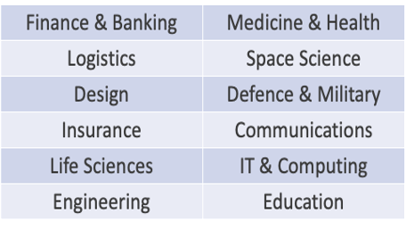
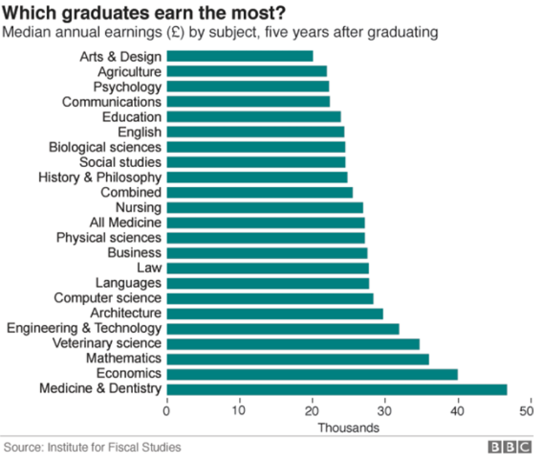

## Skills developed in maths degrees

* Students become *logical numerate problem solvers*
* Develop technical mathematical skills 
* Learn how to apply mathematics to different problems
* Develop computer programming skills
* Develop communication skills


## STEM skills are valuable

:::: {.columns}

::: {.column width="50%"}



:::

::: {.column width="50%"}

:::
::::


## Teaching delivery

* Two teaching semesters in the academic year
* 3 or 4 modules in each semester
* In each module (some combination of):
    - lectures
    - tutorials
    - workshops
    - computer classes

## Final year project 

- develop independent problem solving skills
- work on an exciting mathematical topic
- develop programming and presentation skills
- Topics include: 

    * The $25,000,000,000 eigenvector
    * The Mathematics of monopoly
    * How Sat Navs work?


# Aims for today

## Probability and geometry

- Estimate areas using probabilistic sampling of random numbers (Monte Carlo Method)

## Probability

Celtic winning the Premier League: 

 - odds 8/11
 - implied probability = $\frac{11}{8+11}$= 0.58

Hearts winning the Premier League: 

- odds 5/4
- implied probability: 0.44

## Summing probabilities

Celtic or Hearts to win Premier League: 

- Implied probability 0.58+0.44=1.02


But the true probability of Celtic or Aberdeen winning is 1.

Lesson: the bookie always wins!


## Monte Carlo sampling


- Generate random numbers in order to estimate some quantity of interest


## Estimate $\pi$ using Monte Carlo techniques

:::: {.columns}

::: {.column width="50%"}

Probability of uniformly sampled point falling in circle is

$$
\frac{\textrm{Area circle}}{\textrm{Area square}}=\frac{\pi}{4}
$$

:::

::: {.column width="50%"}
```{python}
#| echo: false
#| fig-width: 3
#| label: fig-circ
#| fig-pos: h

import numpy as np
import matplotlib.pyplot as plt

R=1.0
theta=np.linspace(0,2*np.pi,1000)
fig,ax=plt.subplots()
ax.plot(R*np.cos(theta),R*np.sin(theta),'r')
ax.set_xlabel('$x$')
ax.set_ylabel('$y$')
ax.set_aspect('equal')
ax.axis('square')

ax.set_xlim([-1.0,1.0])
ax.set_ylim([-1.0,1.0])

plt.show()
```
:::

::::


## Estimate definite integral using Monte Carlo method
 
:::: {.columns}


::: {.column width="50%"}
Estimate the definite integral
$$
\int_a^b f(x)\textrm{d}x.
$$


Prob. of uniformly sampled point falling in shaded region
$$
\frac{\textrm{Area shaded}}{\textrm{Area square}}
$$
:::
::: {.column width="50%"}

```{python}
#| echo: false
#| fig-width: 2
#| label: fig-int
#| fig-pos: h


import numpy as np
import matplotlib.pyplot as plt

R=1.0
x=np.linspace(0,1,1000)
fig,ax=plt.subplots()
ax.plot(x,x**2,'r')
ax.set_xlabel('$x$')
ax.set_ylabel('$y$')
ax.set_aspect('equal')
ax.axis('square')

ax.set_xlim([0.0,1.0])
ax.set_ylim([0.0,1.0])

x_fill=np.zeros((len(x)+2,2),dtype=float)
x_fill[0:len(x),0]=x
x_fill[0:len(x),1]=x**2
x_fill[len(x),0]=1
x_fill[len(x),1]=0
x_fill[len(x)+1,0]=0
x_fill[len(x)+1,1]=0
ax.fill(x_fill[:,0],x_fill[:,1])


plt.show()
```

:::

::::

## Method

1. Real life sampling (rice grains)
2. Get a computer to generate samples

See printed worksheet for further details.

## What have we learned?

* We can study mathematics using experiential learning

* We can program algorithms to help understand mathematical concepts 

